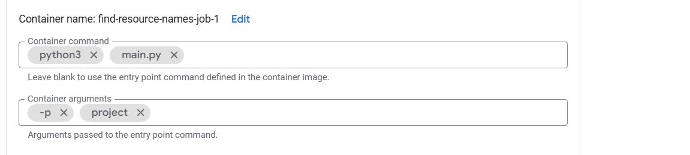

This is not an officially supported Google product. This project is not
eligible for the [Google Open Source Software Vulnerability Rewards
Program](https://bughunters.google.com/open-source-security).

# Dataplex Catalog Transfer Tooling
# Introduction
In 2024 we released Google Cloud Platform Dataplex Catalog as a successor to the Data Catalog product. In relation to announced deprecation of Data Catalog our goal was to make sure everyone has an equal opportunity to transfer their data and integrations to the new platform.

To ease the transition process we exposed a dedicated user interface page “Manage transition to Dataplex”, which gave a graphical interface to the very basic operation related to the data transfer.

Although the user interface based transition might work for some of the smaller datasets it will most likely not work for the largest ones. They might require performing the transition gradually and being aware of the consequences of each step throughout the process as the transfer process is not reversible.

To address this concern we released dedicated tooling, which is encapsulated within this repository.

# Capabilities
## Data discovery
You can discover all projects (with either Data Catalog or Dataplex API enabled) and resources (tag templates & entry groups) that are subjected to transfer.

# Setup
1) Create a new Google Cloud project inside your organization's account.
2) Create a Service Account in the project.
3) Grant the Service Account the following roles at the **organization level**:
   * roles/bigquery.dataEditor
   * roles/browser
   * roles/cloudasset.viewer
   * roles/cloudtasks.admin
   * roles/cloudtasks.enqueuer
   * roles/datacatalog.searchAdmin
   * roles/serviceusage.serviceUsageConsumer
   * roles/dataplex.catalogAdmin
   * roles/logging.configWriter
   * roles/iam.securityReviewer
   * roles/run.invoker
   * roles/bigquery.jobUser
4) Enable API:
   * Cloud Resource Manager API
   * BigQuery API
   * Cloud Tasks API
   * Cloud Run Admin API
   * Cloud Data Catalog API
   * Artifact Registry API
   * Cloud Asset API
   * Dataplex API
   * Datacatalog API
5) Create a Docker repository in Google Artifact Registry
# Build
1) Clone the github repository
    ```
    git clone https://github.com/GoogleCloudPlatform/dataplex-catalog-transfer-tooling.git
    ```
2) Build docker images
    ```
    docker build -t <location>-docker.pkg.dev/<work_project_id>/<repo_id>/fetch-resources-handler:latest -f ./services/handlers/fetch_resources/Dockerfile .
    docker build -t <location>-docker.pkg.dev/<work_project_id>/<repo_id>/fetch-resources-job:latest -f ./services/jobs/fetch_resources/Dockerfile .
    docker build -t <location>-docker.pkg.dev/<work_project_id>/<repo_id>/fetch-projects-handler:latest -f ./services/handlers/fetch_projects/Dockerfile .
    docker build -t <location>-docker.pkg.dev/<work_project_id>/<repo_id>/fetch-projects-job:latest -f ./services/jobs/fetch_projects/Dockerfile .
    docker build -t <location>-docker.pkg.dev/<work_project_id>/<repo_id>/find-resource-names-handler:latest -f ./services/handlers/find_resource_names/Dockerfile .
    docker build -t <location>-docker.pkg.dev/<work_project_id>/<repo_id>/find-resource-names-job:latest -f ./services/jobs/find_resource_names/Dockerfile .
    docker build -t <location>-docker.pkg.dev/<work_project_id>/<repo_id>/fetch-policies-handler:latest -f ./services/handlers/fetch_policies/Dockerfile .
    docker build -t <location>-docker.pkg.dev/<work_project_id>/<repo_id>/fetch-policies-job:latest -f ./services/jobs/fetch_policies/Dockerfile .
    docker build -t <location>-docker.pkg.dev/<work_project_id>/<repo_id>/audit-logs-job:latest -f ./services/jobs/audit_logs/Dockerfile .
    ```
    Where
   * work_project_id - ID of the project you've created for this tool
   * location - location of the repository in Artifact Registry
   * repo_id - ID of the repository in Artifact Registry
3) Push the images to the repository in Artifact Registry
```
docker push <location>-docker.pkg.dev/<work_project_id>/<repo_id>/fetch-resources-handler:latest
docker push <location>-docker.pkg.dev/<work_project_id>/<repo_id>/fetch-resources-job:latest
docker push <location>-docker.pkg.dev/<work_project_id>/<repo_id>/fetch-projects-handler:latest
docker push <location>-docker.pkg.dev/<work_project_id>/<repo_id>/fetch-projects-job:latest
docker push <location>-docker.pkg.dev/<work_project_id>/<repo_id>/find-resource-names-handler:latest
docker push <location>-docker.pkg.dev/<work_project_id>/<repo_id>/find-resource-names-job:latest
docker push <location>-docker.pkg.dev/<work_project_id>/<repo_id>/fetch-policies-handler:latest
docker push <location>-docker.pkg.dev/<work_project_id>/<repo_id>/fetch-policies-job:latest
docker push <location>-docker.pkg.dev/<work_project_id>/<repo_id>/audit-logs-job:latest
```
# Deploy
When you will set up container commands, be sure to input it separately (as at the picture below)

## fetch-projects-job
1) Create Cloud Run job
2) Select ```<location>-docker.pkg.dev/<work_project_id>/<repo_id>/fetch-projects-job:latest``` image
3) In Container section use ```python3 main.py``` container command and ```-p <work_project_id>```
container arguments
4) In Security section select the Service Account you've created
## fetch-resources-job
1) Create Cloud Run job
2) Select ```<location>-docker.pkg.dev/<work_project_id>/<repo_id>/fetch-resources-job:latest``` image
3) In Container section use ```python3 main.py``` container command and ```-p <work_project_id>``` 
container arguments
4) In Security section select the Service Account you've created
## find-resource-names-job
1) Create Cloud Run job
2) Select ```<location>-docker.pkg.dev/<work_project_id>/<repo_id>/find-resource-names-job:latest``` image
3) In Container section use ```python3 main.py``` container command and ```-p <work_project_id>``` 
container arguments
4) In Security section select the Service Account you've created
## fetch-policies-job
1) Create Cloud Run job
2) Select ```<location>-docker.pkg.dev/<work_project_id>/<repo_id>/fetch-policies-job:latest``` image
3) In Container section use ```python3 main.py``` container command and ```-p <work_project_id>``` 
container arguments
4) Set up scope of fetching with ```-s <scope>``` flag. Scope should be in format ```organizations/{orgId}``` or ```folder/{folderId}```
5) You can set up resource type using ```-rt entry_group|tag_template|both``` flag 
6) You can set up system where to fetch policies by using ```-ms data_catalog|dataplex|both``` flag
7) In Security section select the Service Account you've created
## audit-logs-job
1) Create Cloud Run job
2) Select ```<location>-docker.pkg.dev/<work_project_id>/<repo_id>/audit-logs-job:latest``` image
3) In Container section use ```python3 main.py``` container command and ```-p <work_project_id>``` 
container arguments
4) In Security section select the Service Account you've created
## fetch-projects-handler
1) Create Cloud Run service
2) Select ```<location>-docker.pkg.dev/<work_project_id>/<repo_id>/fetch-projects-handler:latest``` image
3) Service name ```fetch-projects-handler``` (Cloud tasks will target this name)
4) location ```us-central1```
5) Authentication - Require authentication
6) In Container section use ```python3 main.py``` container command and ```-p <work_project_id>```
container arguments
7) In Security section select the Service Account you've created
## fetch-resources-handler
1) Create Cloud Run service
2) Select ```<location>-docker.pkg.dev/<work_project_id>/<repo_id>/fetch-resources-handler:latest``` image
3) Service name ```fetch-resources-handler``` (Cloud tasks will target this name)
4) location ```us-central1```
5) Authentication - Require authentication
6) In Container section use ```python3 main.py``` container command and ```-p <work_project_id>```
container arguments
7) In Security section select the Service Account you've created
## find-resource-names-handler
1) Create Cloud Run service
2) Select ```<location>-docker.pkg.dev/<work_project_id>/<repo_id>/find-resource-names-handler:latest``` image
3) Service name ```find-resource-names-handler``` (Cloud tasks will target this name)
4) location ```us-central1```
5) Authentication - Require authentication
6) In Container section use ```python3 main.py``` container command and ```-p <work_project_id>``` 
container arguments
7) In Security section select the Service Account you've created
## fetch-policies-handler
1) Create Cloud Run service
2) Select ```<location>-docker.pkg.dev/<work_project_id>/<repo_id>/fetch-policies-handler:latest``` image
3) Service name ```fetch-policies-handler``` (Cloud tasks will target this name)
4) location ```us-central1```
5) Authentication - Require authentication
6) In Container section use ```python3 main.py``` container command and ```-p <work_project_id>``` 
container arguments
7) In Security section select the Service Account you've created

# Launch
1) Launch fetch-projects-job
2) After finishing launch fetch-resources-job
3) After finishing launch find-resource-names-job
4) After finishing launch fetch-policies-job
5) To see DataCatalog access logs launch audit-logs-job and follow the instructions in [setup-logs-readme](services/jobs/audit_logs/README.md)
6) All data will appear in ```transfer_tooling``` dataset in Google BigQuery